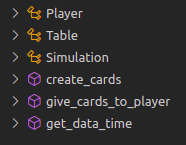
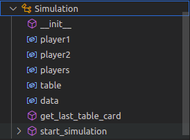

# Cavacamisa

Questo è un progetto che voglio fare da tanto tempo: fare un simulatore di
cavacamisa con vari linguaggi di programmazione. Lo voglio fare per due motivi.

- Uno per provare vari linguaggi e mi sembra interessante imparare ad usarli con un progetto reale.
- Due perchè voglio conoscere bene il "problema" di un simulatore di cavacamisa.

I linguaggi che vorrei provare sono:

- Python
- Javascript
- Go
- Rust
- C
- e poi vediamo

## Come sarà strutturato il simulatore

Il simulatore dovrà poter fare le seguenti operazioni:

1. Ricevere una distribuzione di carte come input oppure generare una distribuzione di carte casuale.
1. A partire dalla distribuzione di carte eseguire la simulazione.
1. Salvare il risultato della simulazione in un file json.

La realizazzione del simulatore può essere fatta in vari modi, utilizzando paradigmi di programmazione diversi.  
In **Python** per la prima versione ho provato ad usare un sistema orientato alle classi. Con la seguente struttura:



Questa è stata la prima soluzione che mi è venuta in mente ma non so se è la soluzione migliore.  
Per questo volevo provare vari linguaggi, per provare qualcosa che mi costringesse a pensare a delle soluzioni
con paradigmi diversi.

In questa prima soluzione all'inteno del file `player.py` sono definite le classe che si vedono nella figura sopra. Nel file `main.py` vengono istanziate queste classe ed eseguito il metodo principale della classe `Simulation` che è `start_simulation` che esegue la simulazione.



Mi piacerebbe fare un altra versione sempre in **Python** ma con una logia più funzionale, con una struttura diversa.

All'interno della classe `Simulation` c'è un oggetto `data` che raccogli i dati del risultato della simulazione con una struttura descritta al punto `3`.

Dovrei affrontare il problema con una prospettiva più **matematica** e cercare di allontanarmi da concetti come _giocare una carta_ o _prendere delle carte_ ma pensare più in termini di **operazioni tra vettori** che cambiano in funzione della seguenza del valore delle 'carte'.

E poi vorrei migliorare il modo in cui vengono salvati i dati in modo da poter fare delle analisi per esempio vedere all'intenrno dell `n` simulazioni che vengono fatte come sono distrubuite le lunghezze delle partite. Con _lunghezza della partita_ intendo quante carte o quante prese vengono fatte prima che si concluda la partita.

Perchè la domanda fondamentale da cui è nato questo mio progetto è: **esiste una partita infinita ?**


## 3 Salvare il file della simulazione in un file json

### JSON file that collect the result

```JSON
{
  "date": "2022/10/02 21:00:00",
  "Start_card_G1": [5, 6, 8, 1, ...],
  "Start_card_G2": [5, 6, 8, 1, ...],
  "Total_played_cards": 121,
  "Total_taking": 5,
}

```

### Some output example

```
Simulation data:
 Date: 2022/10/05 01:25:14
 Start_card_G1: [4, 6, 7, 10, 2, 9, 3, 10, 5, 4, 5, 3, 8, 6, 8, 9, 9, 2, 8, 5]
 Start_card_G2: [10, 4, 7, 5, 7, 4, 1, 7, 6, 9, 10, 1, 1, 2, 3, 2, 6, 8, 3, 1]
 Total_played_cards: 2802
 Total_taking: 450
 Winner: G2

 ```